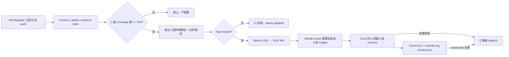

# Meishifu CI/CD 操作文件

本專案使用 GitHub Actions。所有分支 push 都會執行 frontend、admin、backend 三組
測試與 coverage；只有 `main` 的三個 coverage gates 都通過後，才會建立三個
immutable container images、部署到 GCP Cloud Run，最後執行 smoke tests。



## Workflow 行為

Workflow 位於 `.github/workflows/ci-cd.yml`。

- 任意分支 push：執行三組測試與 coverage，並產生合併報告；非 `main` 的 deploy job
  會顯示為 skipped。
- `pull_request` 到 `main`：只執行測試、coverage 與合併報告。
- push 到 `main`：三組測試通過後自動部署。
- `workflow_dispatch`：可從 GitHub Actions 手動重新執行；部署仍只允許 `main`。
- `deploy` job 同時依賴三個 test jobs 與 `coverage-report`；任一測試失敗或 coverage
  低於 70% 時不會執行。
- deployment 前先記錄三個服務目前接收 100% 流量的 revision；deploy 或 smoke test
  任一步驟失敗時，自動將三個服務流量全部切回這些 revisions，workflow 仍維持失敗狀態。
- production concurrency 不取消正在進行的部署，避免兩次發布互相中斷。
- 每次以完整 Git commit SHA 當 image tag，可追蹤及回滾，不使用可變的 `latest`。

## 測試與 coverage

三個 container 的最低 line coverage 門檻都是 70%：

| Container | 測試內容 | Coverage 範圍 | 詳細報告 |
|---|---|---|---|
| frontend | API client、購物車、badge、toast、格式化 | `frontend/js/site.js` | LCOV |
| admin | JWT、管理 API client、登入、狀態與顯示 helper | `admin/js/admin.js` | LCOV |
| backend | Flask routes、DB、JWT、付款與圖片儲存 | runtime Python modules | XML、JSON |

frontend 與 admin 的動畫檔是純視覺漸進增強，不納入 line coverage；container build 與
Cloud Run health check 負責驗證 Nginx 及靜態資產。Backend 排除 `tests/*` 與一次性的
`init_db.py` schema/seed 工具。Backend 測試不會連正式 MySQL，所有 DB 與 GCS I/O
都以 fake 或 monkeypatch 隔離。

每次 workflow 都會：

- 將 frontend、admin、backend 詳細報告分別上傳為 GitHub Actions artifacts。
- 產生 `container-coverage-summary` Markdown artifact，在 Actions run summary 顯示三個
  container 的 coverage、70% 門檻與 job 結果。
- 所有報告保留 14 天。

本機執行與 CI 相同的測試：

```bash
mkdir -p frontend/coverage admin/coverage
node --test --experimental-test-coverage --test-coverage-lines=70 \
  --test-coverage-include='frontend/js/site.js' \
  --test-reporter=spec --test-reporter=lcov \
  --test-reporter-destination=stdout \
  --test-reporter-destination=frontend/coverage/lcov.info \
  frontend/tests/site.test.js

node --test --experimental-test-coverage --test-coverage-lines=70 \
  --test-coverage-include='admin/js/admin.js' \
  --test-reporter=spec --test-reporter=lcov \
  --test-reporter-destination=stdout \
  --test-reporter-destination=admin/coverage/lcov.info \
  admin/tests/admin.test.js
```

```bash
cd backend
uv sync --frozen --dev
uv run pytest \
  --cov=. \
  --cov-report=term-missing \
  --cov-report=xml:coverage.xml \
  --cov-report=json:coverage.json \
  --cov-fail-under=70
```

## GCP 無金鑰驗證

CI 不使用 service-account JSON key，也不把 DB 密碼存進 GitHub。GitHub Actions
透過 OIDC 與 GCP Workload Identity Federation 取得短效憑證；DB、JWT 與管理員憑證
繼續由 GCP Secret Manager 提供給 Cloud Run。

使用具有 IAM 管理權限、且已登入正確專案的 gcloud SDK，一次性執行：

```bash
gcloud auth list
gcloud config set project meishifu

PROJECT_ID=meishifu \
GITHUB_REPOSITORY=Henry4234/meishifu \
bash deploy/gcp/bootstrap-github-actions.sh
```

腳本最後會輸出以下兩個值。到 GitHub repository 的
`Settings → Secrets and variables → Actions → Variables` 建立：

| GitHub variable | 值 |
|---|---|
| `GCP_WORKLOAD_IDENTITY_PROVIDER` | 腳本輸出的完整 provider resource name |
| `GCP_SERVICE_ACCOUNT` | `github-actions-deployer@meishifu.iam.gserviceaccount.com` |

這兩個值是 resource identifiers，不是密碼。GitHub repository 不需要保存
`DB_AC`、`DB_PW`、`SECRET_KEY`、`ECPAY_HASH_KEY`、`ECPAY_HASH_IV` 或 GCP JSON key。

ECPay 正式金鑰必須先建立在 GCP Secret Manager；CI 只引用 secret resource name，
不會讀取或輸出 secret value：

| Cloud Run env | Secret Manager resource |
|---|---|
| `ECPAY_HASH_KEY` | `meishifu-ecpay-hash-key` |
| `ECPAY_HASH_IV` | `meishifu-ecpay-hash-iv` |

`ECPAY_MERCHANT_ID`、`ECPAY_ENV`、正式站台 URL 與 callback URL 為非機密設定，
由 `.github/workflows/ci-cd.yml` 傳給 `deploy/gcp/deploy-ci.sh`。ECPay 的 server-to-server
`ReturnURL` 使用 Cloud Run origin，避免經過 Cloudflare；付款結果頁再導回 `meishifu.org`。
金流目前使用 `production`；物流在取得正式物流專用 MerchantID 前維持 `stage`，兩者
不可混用帳號。

## GCP 部署內容

`deploy/gcp/deploy-ci.sh` 只負責日常 CI deployment，不會初始化 DB，也不會新增、讀取
或輪替 Secret Manager 內容：

1. 在 GitHub-hosted runner 建置 frontend、admin、backend images，並以完整 commit SHA
   推送到 `asia-east1-docker.pkg.dev/meishifu/meishifu`。
2. 更新 `meishifu-backend`、`meishifu-frontend`、`meishifu-admin` 三個既有 services。
3. backend revision 繼續引用既有 DB/JWT/Tailscale/ECPay Secret Manager 與 private uploads bucket。
4. workflow 對三個 Cloud Run origins，以及 `meishifu.org` 的 API、官網與 management
   路由執行 smoke test。

Backend production DB 流量改經 Tailscale userspace networking。CI 將 PyMySQL 指到
容器內 `127.0.0.1:13306` proxy，proxy 再經 Tailscale SOCKS5 連
`100.74.151.0:3306`；auth key 引用既有 Secret Manager `tailscale-auth-key`。容器在
Gunicorn 啟動前會驗證此 private DB path，驗證失敗會使 deployment 失敗並觸發
rollback。設定、key 輪替與 tailnet grant 詳見 [Cloud Run 透過 Tailscale 連 MySQL](TAILSCALE-DB.md)。

Cloud Run 保留部分以 `z` 結尾的 URL path，官方建議避免所有這類 path。因此 frontend
與 admin 使用 `/health`，而不是會在 Google Frontend 被攔截的 `/healthz`。詳見
[Cloud Run reserved URL paths](https://docs.cloud.google.com/run/docs/known-issues#reserved-url-paths)。

Workflow 明確傳入 project number `729707774647`，日常 deployer 不需要呼叫
`gcloud projects describe`，因此不依賴 Cloud Resource Manager API，也不需要增加
project-wide 專案讀取角色。

CI deployer 只取得單一 Artifact Registry repository 的 Writer、三個既有 Cloud Run
services 的 Developer，以及指定 service identities 的 `actAs`；不授予 project-wide
Cloud Build Editor 或 Cloud Run Admin。

`deploy/gcp/deploy.sh` 與 `deploy/cloudbuild.yaml` 保留給首次建置 infrastructure、手動
Cloud Build 或明確輪替秘密；CI 不應使用它，因為它需要 DB credentials，而且負責的
範圍比日常部署更大。

## Branch protection 建議

在 GitHub `Settings → Branches` 對 `main` 建立規則：

- Require a pull request before merging。
- Require status checks to pass before merging。
- 將 `Frontend tests (coverage >= 70%)`、`Admin tests (coverage >= 70%)`、
  `Backend tests (coverage >= 70%)` 與 `Container coverage report` 設為 required checks。
- 禁止 bypass required checks，並限制誰可以直接 push `main`。

即使有人直接 push `main`，workflow 仍會先測試；只有測試成功才部署。但 branch
protection 可以把錯誤更早擋在 merge 前。

## 回滾與問題排查

查看 revisions：

```bash
gcloud run revisions list --project meishifu --region asia-east1 \
  --service meishifu-backend
```

將流量切回指定 revision：

```bash
gcloud run services update-traffic meishifu-backend \
  --project meishifu \
  --region asia-east1 \
  --to-revisions REVISION_NAME=100
```

frontend 與 admin 使用相同方式回滾。若 workflow 在 authentication 階段失敗，先確認
兩個 GitHub Variables、OIDC provider 的 repository/main condition，以及 GitHub job
具有 `id-token: write`。若 image build、push 或 deployment 失敗，從 Actions log 中的
Docker／Artifact Registry 輸出與三個 `gcloud run deploy` 步驟查詢。

CI 自動 rollback 使用 `deploy/gcp/rollback-ci.sh`。它不刪除失敗 revision 或 image，
只將三個 services 的流量切回部署前 revisions，保留完整稽核與除錯資料。Rollback
本身若有任何服務失敗，也會讓該步驟失敗並在 Actions log 清楚列出服務名稱。

## `deploy/` 是否應加入 `.gitignore`

不應該。本資料夾存放的是 deployment source code 與 declarative config，而不是部署後
產生的輸出。GitHub runner checkout repository 後，必須能讀到 `cloudbuild.yaml`、
`deploy-ci.sh` 與 Cloudflare Worker 設定，CI/CD 才可重現、審查與回滾。

應忽略的是 secrets 與 generated artifacts，例如 `.env`、`gha-creds-*.json`、
`.wrangler/`、`.coverage`、`coverage.xml`、`htmlcov/` 與 Wrangler 產生的
`worker-configuration.d.ts`；這些項目已寫入 `.gitignore`。
