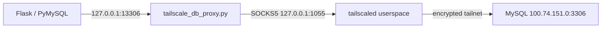

# Cloud Run 透過 Tailscale 連 MySQL

本專案的 production backend 不再直接連公開的 MySQL 位址。Cloud Run 沒有
`/dev/net/tun`，因此使用 Tailscale userspace networking 與 SOCKS5，再由容器內的
loopback-only Python TCP proxy 讓 PyMySQL 不必自行支援 SOCKS5。



Tailscale 官方的 Cloud Run 指南也採用 userspace mode、local SOCKS5 與 Secret
環境變數；userspace mode 不會建立一般 Linux TUN route，因此 MySQL driver 不能只把
host 改成 `100.74.151.0`。參考：

- [Tailscale on Google Cloud Run](https://tailscale.com/docs/install/cloud/cloudrun)
- [Userspace networking mode](https://tailscale.com/docs/concepts/userspace-networking)

## Repository 實作

- `backend/Dockerfile` 從官方 `tailscale/tailscale:v1.102.3` image 複製
  `tailscale` / `tailscaled` binaries，應用程式仍以非 root `app` 使用者執行。
- `backend/start-with-tailscale.sh` 使用 memory-only state 與 `/tmp` control socket，
  拒絕 subnet routes、啟用 shields-up、限制登入等待 60 秒，完成 `tailscale up` 後
  立刻從子程序環境移除 `TAILSCALE_AUTHKEY`。Cloud Run node 只主動連 DB，不接受
  Tailnet inbound connection。
- Auth key 只會短暫寫入權限 `0600` 的 container `/tmp` 檔；Tailscale CLI 使用
  `file:` 讀取，避免 key 出現在 process arguments，登入完成或啟動失敗都會刪除。
- 啟動 Flask 前會先實際經 SOCKS5 連到 MySQL TCP port；route、grant 或 MySQL listener
  不通時 container 不會進入 Ready，CI deployment 會失敗並觸發既有 rollback。
- `backend/tailscale_db_proxy.py` 固定只監聽 `127.0.0.1`，不能從 Cloud Run ingress
  直接存取。任何 `tailscaled`、proxy 或 Gunicorn critical process 結束時，container
  也會結束並由 Cloud Run 取代。
- `TAILSCALE_ENABLED` 預設為 `false`；只有 GCP deployment 明確設為 `true`。本機
  Docker Compose 仍依 `.env` 直接連開發 DB，不需要 Tailscale key。

Production runtime 設定如下：

| 設定 | 值 | 說明 |
|---|---|---|
| `DB_HOST` | `127.0.0.1` | PyMySQL 只連本機 proxy |
| `DB_PORT` | `13306` | 本機 proxy port |
| `TAILSCALE_DB_HOST` | `100.74.151.0` | DB 主機的 Tailnet IP |
| `TAILSCALE_DB_PORT` | `3306` | MySQL port |
| `TAILSCALE_AUTHKEY` | Secret `tailscale-auth-key:latest` | 不進 Git / image |

## Tailscale auth key 與 grants

目前 Cloud Run service 的 `maxScale` 是 20，因此單次 key 無法支援同時或先後啟動的
多個 ephemeral instances。`tailscale-auth-key` 應設定為：

- Reusable：支援 Cloud Run 多 instance；務必只放在 GCP Secret Manager。
- Ephemeral：instance 離線後自動清理 node。
- Pre-approved：若 tailnet 啟用 device approval。
- Tagged：建議套用 `tag:meishifu-backend`，以最小權限限制只能連 DB TCP 3306。
- 短效期並定期輪替；Tailscale auth key 最長 90 天。

既有 Secret Manager 內容無法顯示 key 建立時的 Tailscale flags。若不能確認目前 key
是否為 reusable + ephemeral + tagged，應在 Tailscale 產生新 key 後輪替。參考
[Tailscale auth keys](https://tailscale.com/docs/features/access-control/auth-keys) 與
[ephemeral nodes](https://tailscale.com/docs/features/ephemeral-nodes)。

以下是要合併進既有 tailnet policy 的最小 grant 範例，不要用它覆蓋其他既有規則：

```json
{
  "tagOwners": {
    "tag:meishifu-backend": ["autogroup:admin"]
  },
  "grants": [
    {
      "src": ["tag:meishifu-backend"],
      "dst": ["100.74.151.0"],
      "ip": ["tcp:3306"]
    }
  ]
}
```

Tailscale 現行文件建議新 policy 使用 grants；規則為 deny-by-default，只有明確列出的
來源、目的地與 protocol/port 可通過。參考 [Grants syntax](https://tailscale.com/docs/reference/syntax/grants)。

DB 主機還必須符合：

- Tailscale node 上的 `100.74.151.0` 可連線，且 node state 持久保存。
- MySQL 確實監聽可由 Tailscale 到達的介面與 TCP 3306。
- MySQL 帳號的 host policy 接受 Cloud Run ephemeral Tailscale nodes。
- Tailscale grant 生效後，先完成一次 production DB read/write 驗證，再關閉路由器／
  防火牆對 public Internet 的 TCP 3306；關閉 public port 不由此 repository 自動執行。

## GCP Secret Manager（只用 gcloud SDK）

專案目前預期使用 `tailscale-auth-key`。先確認 secret、enabled version 與 runtime
service account 權限，不會讀出 secret 值：

```bash
gcloud secrets describe tailscale-auth-key --project meishifu
gcloud secrets versions list tailscale-auth-key --project meishifu
gcloud secrets get-iam-policy tailscale-auth-key --project meishifu
```

輪替 key 時，不把值放在 shell history：

```bash
read -rs TAILSCALE_AUTHKEY
printf %s "${TAILSCALE_AUTHKEY}" | gcloud secrets versions add tailscale-auth-key \
  --project meishifu \
  --data-file=-
unset TAILSCALE_AUTHKEY
```

確認 Cloud Run runtime identity 可讀取該 secret：

```bash
gcloud secrets add-iam-policy-binding tailscale-auth-key \
  --project meishifu \
  --member serviceAccount:meishifu-runtime@meishifu.iam.gserviceaccount.com \
  --role roles/secretmanager.secretAccessor
```

`deploy/gcp/deploy-ci.sh` 只引用既有 secret，不建立或讀取秘密。首次 infrastructure
腳本 `deploy/gcp/deploy.sh` 會沿用既有 secret；只有明確提供 `TAILSCALE_AUTHKEY` 時才
新增版本。

## 上線與驗證

PR 合併到 `main` 後，GitHub Actions 先執行三個 coverage gates，再部署。backend
startup 會驗證 Tailscale → MySQL TCP 路徑；任何失敗都不會切換成功，workflow 會將
三個 Cloud Run services 流量切回部署前 revisions。

部署完成後以 SDK 檢查新 revision（輸出不含 secret 值）：

```bash
gcloud run services describe meishifu-backend \
  --project meishifu \
  --region asia-east1 \
  --format='yaml(status.latestReadyRevisionName,spec.template.spec.containers[0].env)'

gcloud logging read \
  'resource.type="cloud_run_revision" AND resource.labels.service_name="meishifu-backend"' \
  --project meishifu \
  --freshness 30m \
  --limit 100
```

預期日誌包含 Tailscale 啟動、`Successfully reached MySQL ... through Tailscale`、proxy
listen 與 Gunicorn startup；不應再看到應用程式嘗試連 `114.35.125.200:3306`。
